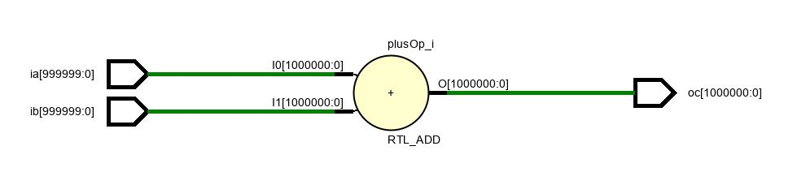
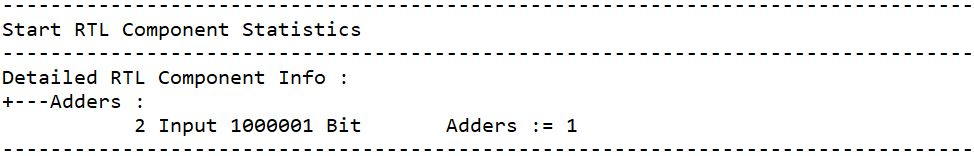

# One Million Bits Adder of FPGA  

Experiment implementation of adder with two one million bits inputs. Check Youtube video
* [Src](/src/one_million_bits_adder) ;   [Youtube](https://youtu.be/DvfNNtKknjE) ;  
  
